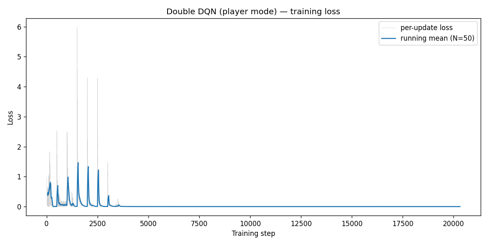
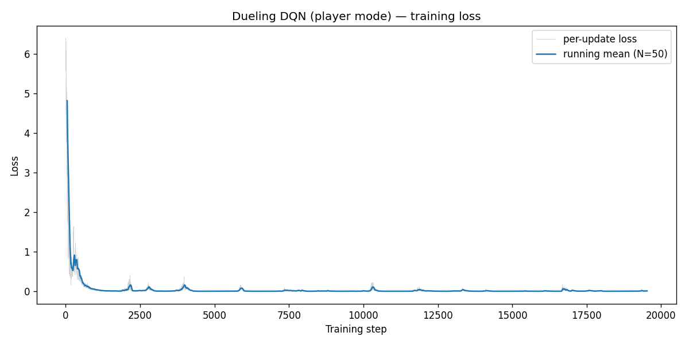
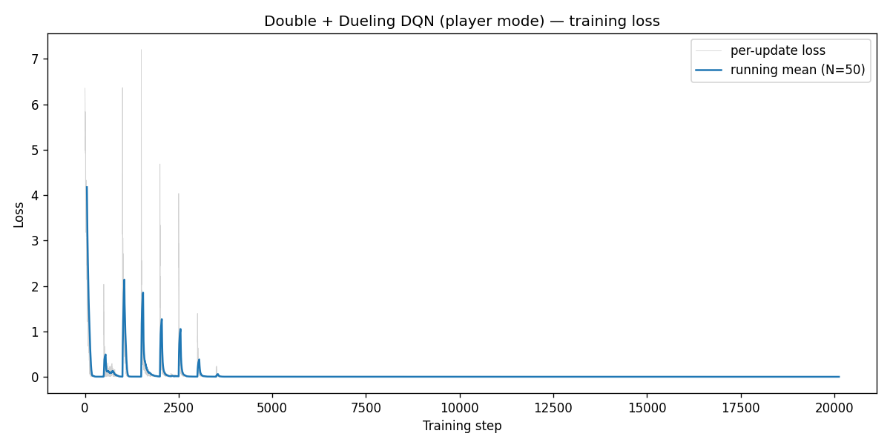
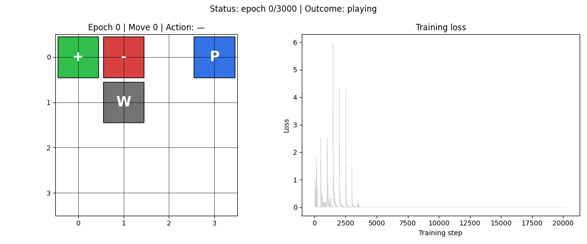
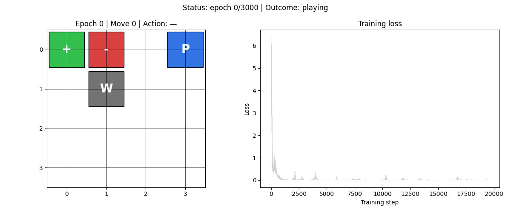

# HW3-2：Double DQN、Dueling DQN 與 Combined DQN

> **環境**：4×4 Gridworld　**模式**：player（障礙物固定，Player 起始隨機）
> **基礎**：承接 HW3-1 的 replay buffer + target network

---

## 演算法說明

HW3-1 的 DQN 存在兩個已知缺陷：Q-value 高估（overestimation）以及 action advantage 與 state value 難以分離。HW3-2 引入三個改良版本逐一解決。

---

### Double DQN

**問題根源**：標準 DQN 用同一個 target network 同時做「選動作」和「估值」：

```
Y = r + γ · max_a' Q_target(s', a')
```

`max` 運算在有雜訊的估計下會系統性地高估 Q 值（Jensen's inequality 的副作用）。

**Double DQN 的修正**：動作選擇與價值估計分開：

```
a* = argmax_a' Q_online(s', a')      ← 用 online network 選動作
Y  = r + γ · Q_target(s', a*)        ← 用 target network 算 Q 值
```

兩個網路的偏誤方向不同，高估效應相互抵消，讓 Y 更接近真實報酬。

---

### Dueling DQN

**問題根源**：在某些狀態下，不管採取哪個動作結果都差不多（例如走廊中間）。標準 DQN 會把「這個狀態本來就不好」的資訊和「這個動作特別差」的資訊混在一起學，效率低。

**Dueling Architecture**：將 Q 值拆成兩個分支：

```
Q(s, a) = V(s) + A(s, a) − mean_a'[A(s, a')]
```

- **V(s)**：state value，衡量「在這個狀態有多好」
- **A(s, a)**：advantage，衡量「這個動作比平均好多少」
- 減去 mean advantage 是為了讓分解唯一（否則 V 和 A 可以互相抵消任意值）

好處：V(s) 在更新任何動作時都能被訓練到，資料效率更高。

---

### Combined DQN（Double + Dueling）

同時使用兩種改良：

- **網路架構**：Dueling（分 V 和 A 兩個 head）
- **Target 計算**：Double DQN（online 選動作，target 估值）

這是理論上最完整的組合，也是後續 HW3-3 / HW3-4 的基礎。

---

## 實驗設定

三個實驗共用相同超參數：

| 超參數 | 值 |
|--------|----|
| epochs | 3000 |
| γ (gamma) | 0.9 |
| ε | 0.3（固定） |
| lr | 0.001 |
| mem_size | 1000 |
| batch_size | 200 |
| max_moves | 50 |
| sync_freq | 500 |
| 環境模式 | player |

**player 模式**：Pit 和 Wall 位置固定，只有 Player 起始位置每局隨機。比 static 難，比 random 容易。

---

## 量化結果

| 方法 | 勝率 | 平均步數（贏） | Loss mean±std（後 100 步） | 訓練時間 |
|------|------|--------------|--------------------------|----------|
| Double DQN | **100%** | 4.31 步 | 0.000408 ± 0.000102 | 32.8 秒 |
| Dueling DQN | **100%** | 4.35 步 | 0.00843 ± 0.00415 | 35.0 秒 |
| Combined DQN | **100%** | 4.32 步 | 0.000334 ± 0.000120 | 39.6 秒 |

三個方法在 player 模式下都達到 100% 勝率，且平均步數相近（約 4.3 步）。

---

## Loss 曲線

| Double DQN | Dueling DQN | Combined DQN |
|:---:|:---:|:---:|
|  |  |  |

---

## 策略動畫

| Double DQN | Dueling DQN | Combined DQN |
|:---:|:---:|:---:|
|  |  |  |

---

## 觀察與討論

**1. player 模式對三種方法都不難**

player 模式的棋盤配置固定（只有 Player 起點隨機），有效狀態數遠小於 random 模式。三種方法都能在 3000 epoch 內收斂到 100%，在這個問題上沒有明顯高下之分。

**2. Loss 數值的差異反映架構特性**

Dueling DQN 的 loss（0.00843）比 Double DQN（0.000408）高出約 20 倍。這不代表 Dueling 較差——Dueling 的 V head 和 A head 各自輸出較大的絕對值，再組合成 Q，造成 MSE 天生偏大。Combined 的 loss 最低（0.000334），是因為 Double 的 target 更準確，讓網路更快收斂到小殘差。

**3. 步數效率接近理論最佳**

4×4 Gridworld 從角落到中心最短路徑約 4 步。三個方法的平均步數都在 4.3 步左右，意味著訓練後的策略已接近最優路徑，極少繞路。

**4. Combined = 兩者之長，無明顯代價**

Combined 同時消除 Q 高估（Double）並提升狀態價值估計效率（Dueling），訓練時間僅增加約 7 秒（相較 Double），在更難的環境（random 模式）預期會有更顯著的優勢，這在 HW3-3 中得到驗證。
