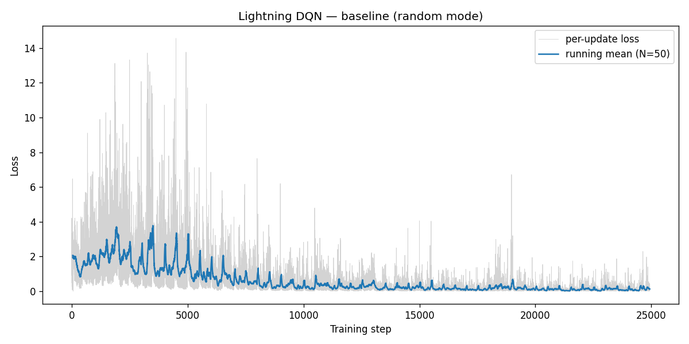
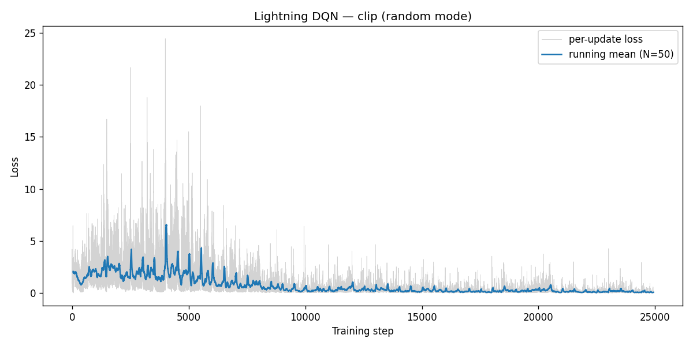
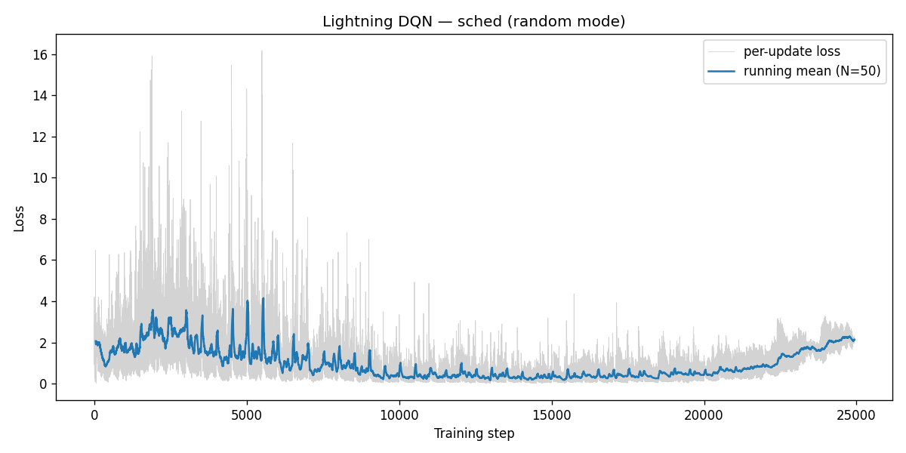
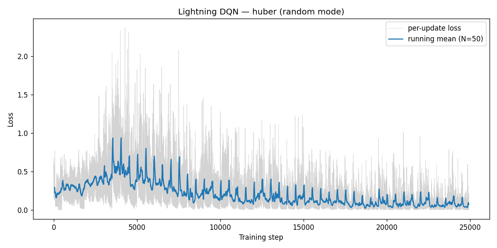
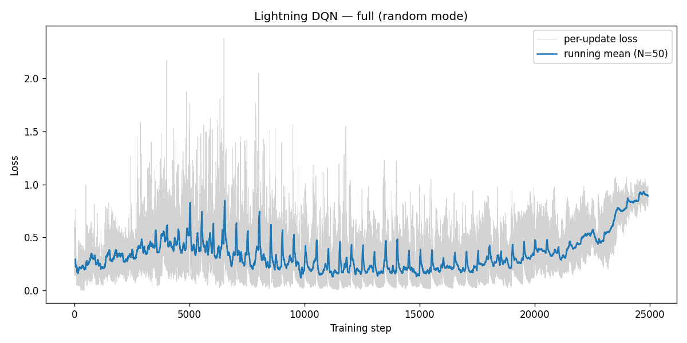
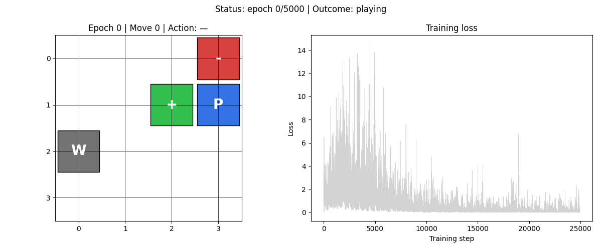
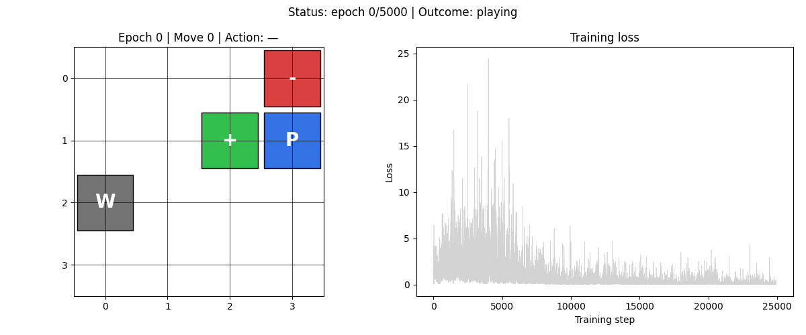
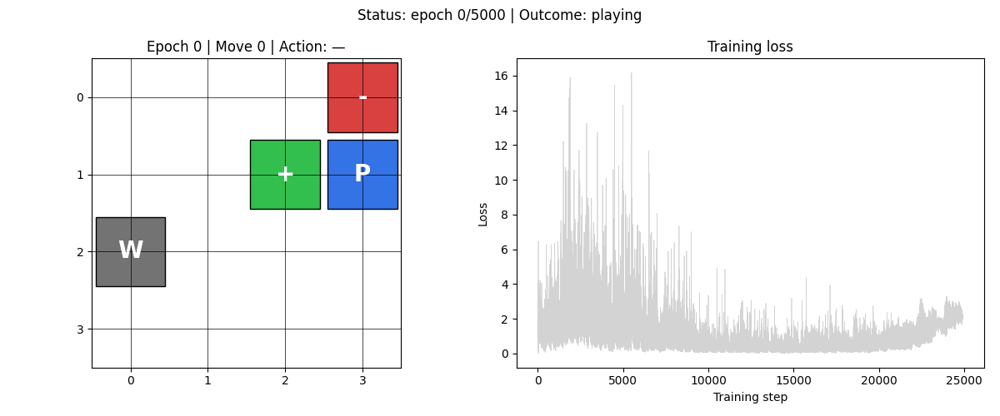
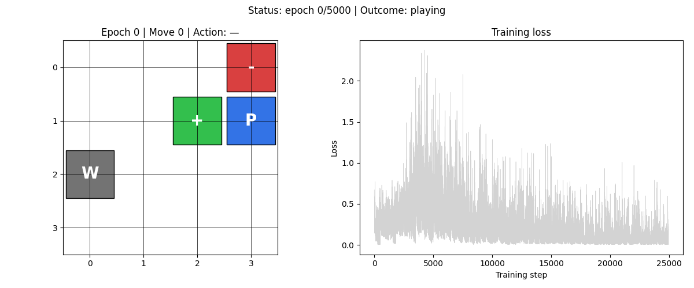
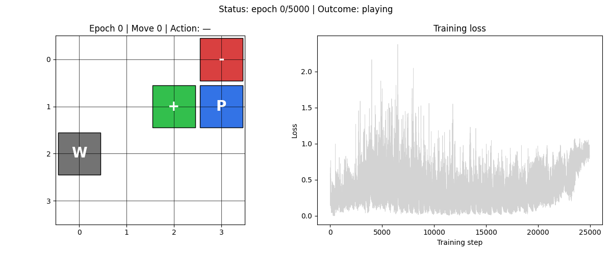

# HW3-3：PyTorch Lightning 與訓練技巧

> **環境**：4×4 Gridworld　**模式**：random（最難）
> **基礎**：HW3-2 的 Combined DQN（Double + Dueling）移植至 PyTorch Lightning

---

## 背景

HW3-3 做兩件事：

1. **框架遷移**：把 HW3-2 的手工訓練迴圈改用 PyTorch Lightning 包裝，讓訓練邏輯更模組化。
2. **訓練技巧比較**：在 random 模式（比 player 更難）下測試三種訓練改良各自的效果。

**為什麼換 random 模式？** player 模式太容易，所有方法都是 100%，看不出差異。random 模式每局棋盤不同，泛化更難，改良效果才會顯現。

---

## 三種訓練技巧

### Gradient Clipping（梯度裁剪）

```python
# PyTorch Lightning Trainer 設定
trainer = pl.Trainer(gradient_clip_val=10.0)
```

強制梯度 L2 norm 不超過 10.0。防止偶發的大 TD error 引起梯度爆炸，讓訓練曲線更平穩。

### Cosine Annealing LR Schedule

```python
scheduler = CosineAnnealingLR(optimizer, T_max=total_epochs)
```

學習率從初始值 0.001 按餘弦曲線衰減到接近 0：

```
lr(t) = lr_min + 0.5 × (lr_max − lr_min) × (1 + cos(π × t / T_max))
```

理論上讓後期訓練更精細收斂。

### Huber Loss（SmoothL1Loss）

```python
nn.SmoothL1Loss()  # 等同 Huber loss，delta=1.0
```

對大 TD error（|δ| > 1）從 MSE（二次）改為線性懲罰，降低異常值的影響，讓梯度更穩定。

---

## 五種實驗配置

| 配置名稱 | 梯度裁剪 | Cosine Schedule | Huber Loss |
|---------|:------:|:------:|:------:|
| baseline | ✗ | ✗ | ✗ |
| clip | ✓ | ✗ | ✗ |
| sched | ✗ | ✓ | ✗ |
| huber | ✗ | ✗ | ✓ |
| full | ✓ | ✓ | ✓ |

---

## 實驗設定

| 超參數 | 值 |
|--------|----|
| epochs | 5000 |
| γ (gamma) | 0.9 |
| ε | 0.3（固定） |
| lr | 0.001 |
| mem_size | 1000 |
| batch_size | 200 |
| max_moves | 50 |
| sync_freq | 500 |
| 梯度裁剪值 | 10.0（若啟用） |

---

## 量化結果

| 配置 | 勝率 | 平均步數（贏） | Loss mean±std（後 100 步） | 訓練時間 |
|------|------|--------------|--------------------------|----------|
| baseline | 86.4% | 2.63 步 | 0.1542 ± 0.1987 | 137.0 秒 |
| clip | 83.2% | 2.65 步 | **0.0559 ± 0.0874** | 146.5 秒 |
| sched | **88.2%** | 2.69 步 | 2.1230 ± 0.1991 ⚠️ | 128.1 秒 |
| huber | 86.2% | 2.59 步 | 0.0757 ± 0.1109 | 131.4 秒 |
| full | 87.6% | 2.62 步 | 0.8963 ± 0.0539 ⚠️ | 146.2 秒 |

---

## Loss 曲線

| baseline | clip |
|:---:|:---:|
|  |  |

| sched | huber |
|:---:|:---:|
|  |  |

| full | |
|:---:|:---:|
|  | |

---

## 策略動畫

| baseline | clip | sched |
|:---:|:---:|:---:|
|  |  |  |

| huber | full | |
|:---:|:---:|:---:|
|  |  | |

---

## 觀察與討論

**1. 勝率差距不大，但 Loss 差異明顯**

五種配置的勝率集中在 83–88%，差距在 5% 以內。以 random 模式的難度而言，這個區間是合理的上限——剩餘失敗主要來自幾何陷阱（Pit 緊鄰 Goal），不是演算法的問題。

**2. sched 和 full 的 Loss 異常偏高**

sched（2.12）和 full（0.90）的 loss 遠高於其他配置，卻有高於 baseline 的勝率。原因是 `CosineAnnealingLR` 在 5000 epoch 結束時把 lr 降到接近 0，此時網路雖然學到了好策略，但面對新 mini-batch 時 Q-value 幾乎無法更新，TD error 積累在 loss 上。

換句話說：**loss 高是 lr 接近零後「學不動」的副作用，不代表策略差**。

**3. clip 讓 Loss 更穩定，但略微影響勝率**

梯度裁剪確實將 loss std 從 0.1987 壓縮至 0.0874（降 56%），但也可能在某些 epoch 裁掉了「有益的大梯度」，稍微影響探索能力，導致勝率小幅下滑（86.4% → 83.2%）。

**4. Huber 是最均衡的單一改良**

huber 配置 loss 穩定（std=0.111）、勝率持平（86.2%），且訓練時間最短之一（131 秒）。對於 Gridworld 這種偶有大 TD error（掉入 Pit 的 -10 reward）的環境，Huber loss 能有效抑制這些極端樣本的影響。

**5. full 沒有「三技合一、效果加成」**

理論上三種技巧互補，實際上 CosineAnnealingLR 的副作用（lr → 0）部分抵銷了 clip 和 huber 的穩定效果。full 的勝率（87.6%）高於 baseline，但未超越 sched 單獨使用（88.2%），是因為 sched 在這個環境碰巧讓 lr 退火到合適的值。
