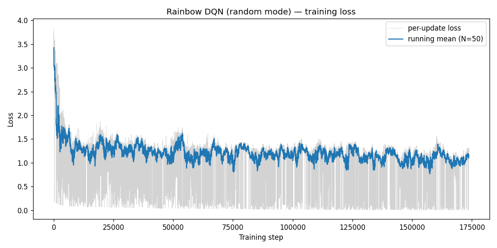
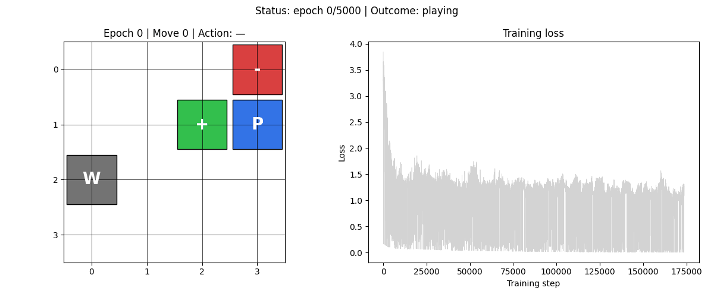

# HW3-4：Rainbow DQN

> **環境**：4×4 Gridworld　**模式**：random
> **目標**：整合六種 DQN 改良，測試「全套升級」在小型環境的極限

---

## Rainbow DQN 的六個組件

Rainbow（Hessel et al., 2017）把六個獨立的 DQN 改良合為一體：

| 組件 | 解決的問題 |
|------|----------|
| Double DQN | Q-value 高估 |
| Dueling Architecture | State value 與 action advantage 耦合 |
| Prioritized Experience Replay (PER) | 均勻取樣效率低，重要 transition 學習機會少 |
| Multi-step Returns（N-step） | 單步 TD 信號延遲，回報傳播慢 |
| Distributional RL（C51） | 只學 Q 均值，忽略回報分佈資訊 |
| NoisyNet | ε-greedy 探索不足，需要手動調整 ε |

---

## 各組件細節

### Prioritized Experience Replay（PER）

標準 replay buffer 對所有 transition 一視同仁。PER 依據 TD error 大小給予不同取樣優先度：

```
p_i = |δ_i|^α + ε_PER       # 優先度（α=0.6）
P(i) = p_i / Σ p_j           # 取樣機率
w_i = (N · P(i))^(−β)        # IS 修正權重（β 從 0.4 逐漸升至 1.0）
```

SumTree 資料結構讓 O(log N) 完成取樣和更新。

### Multi-step Returns（N-step = 3）

不用單步 TD，而是把未來 N 步的折扣回報加總再 bootstrap：

```
R_n = Σ_{k=0}^{N-1} γ^k · r_{t+k} + γ^N · Q(s_{t+N}, a*)
```

N=3 讓獎勵信號可以向前傳播 3 步，比單步更快讓遠離目標的狀態學到正確方向。

### Distributional RL（C51）

不學 E[Q]，而是學回報的完整分佈。把 [−10, 10] 均勻切成 51 個 atom，網路輸出每個 (state, action) 在每個 atom 上的機率：

```
loss = KL( project(T̂Z) || Z_θ(s, a) )
```

Bellman operator 作用在分佈上，再投影回 51 個 atom，用 KL divergence 做損失。

從分佈取 Q 值：

```python
def q_values(self, x):
    probs = self.forward(x)          # (B, 4, 51)
    return (probs * self.atoms).sum(-1)   # (B, 4)
```

### NoisyNet（Factorised Gaussian Noise）

把 Linear 層替換為 NoisyLinear，weight 和 bias 帶有可學習的噪音：

```
y = (μ_w + σ_w ⊙ ε_w) · x + (μ_b + σ_b ⊙ ε_b)
```

探索由噪音驅動，不再需要 ε-greedy（ε 固定為 0）。

---

## 實驗設定

| 超參數 | 值 |
|--------|----|
| epochs | 5000 |
| γ (gamma) | 0.9 |
| lr | 0.0005 |
| mem_size | 1000 |
| batch_size | 200 |
| max_moves | 50 |
| sync_freq | 500 |
| N-step | 3 |
| n_atoms（C51） | 51 |
| v_min / v_max | −10.0 / 10.0 |
| PER α | 0.6 |
| PER β start | 0.4 |

---

## 量化結果

| 指標 | 值 |
|------|----|
| 勝率 | **13.4%** |
| 平均步數（贏） | 2.28 步 |
| Loss mean（KL divergence，後 100 步） | 1.151 |
| Loss std | 0.137 |
| 訓練時間 | **1101.7 秒**（≈ 18 分鐘） |

相較 HW3-3 的 baseline（86.4%，137 秒），Rainbow 的勝率暴跌至 13.4%，訓練時間卻增加 8 倍。

---

## Loss 曲線

| rainbow_random |
|:---:|
|  |

Loss 是 KL divergence，不可直接與前幾階段的 MSE 比較。

---

## 策略動畫

| rainbow_random |
|:---:|
|  |

---

## 失敗分析

Rainbow 在這個問題上表現極差，原因是六個組件都對「大環境」設計，放進 4×4 Gridworld 後每個假設都出問題。

**C51（51 atoms）在小型環境過度分散**

Gridworld 的回報只有三種：−1（普通步）、−10（Pit）、+1（Goal）。把 [−10, 10] 切成 51 個 atom，有效回報只分佈在 3 個 atom 上，其餘 48 個都是「空的」。KL loss 需要把機率質量塞進這三個位置，但 Bellman 投影時每步都要做 atom 對齊，引入了大量數值誤差，讓學習信號非常嘈雜。

**PER 強化了壞的 transition**

剛開始訓練時，掉進 Pit 的 transition TD error 最大（因為 Q-value 初始化為接近 0，reward 卻是 −10），PER 會反覆取樣這些失敗經驗。對大型環境這能加速學習「危險區域」；在 Gridworld 裡，buffer 只有 1000 筆，PER 讓這些 Pit transition 佔據高達 70% 以上的取樣機率，模型反而學不到怎麼贏。

**NoisyNet 探索在早期太弱**

NoisyNet 的噪音程度取決於 σ 的初始化（factorised noise 的 σ 初始設為 0.5 / √fan_in）。在訓練初期，σ 很快就被梯度壓縮，等同於關掉探索。而標準的 ε=0.3 是固定的探索保底，NoisyNet 沒有這個保底，導致早期探索不足，replay buffer 填滿的都是重複路徑。

**N-step = 3 在稀疏 reward 下放大誤差**

Gridworld 大部分步的 reward 是 −1，Goal 只有到達時才有 +1。N-step 把 3 步的 reward 加起來 bootstrap，如果第 1、2 步是 −1，第 3 步才碰到 Goal，那 target 估計是 −1 − 0.9 − 0.81 + 0.9³ × Q(s+3)。但在訓練早期 Q(s+3) 估計極不準，N-step 讓這個誤差放大了 3 倍效果傳回去。

**結論**

Rainbow 的每個組件在 Atari（大型、連續、視覺狀態空間）中都有紮實的理論和實驗支持。但 4×4 Gridworld 只有 64 個格子、3 種 reward，這些組件的假設（大狀態空間、連續回報分佈、需要強探索）完全不成立，六個組件疊加後的相互干擾反而讓訓練比最簡單的 DQN 還差。

這不是 Rainbow 的失敗，而是「過度工程化（over-engineering）」在簡單問題上的典型教訓。
