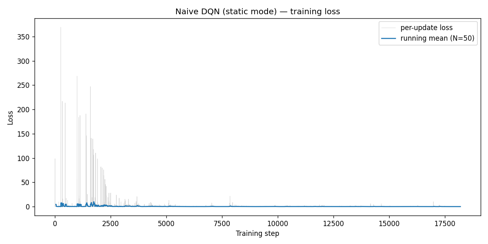
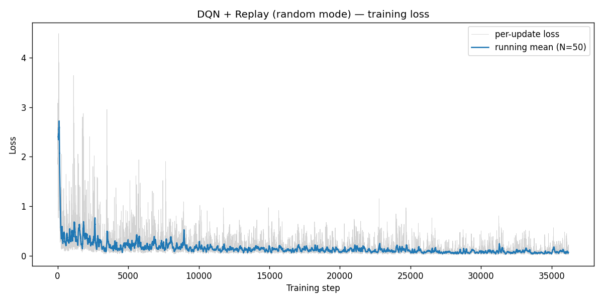
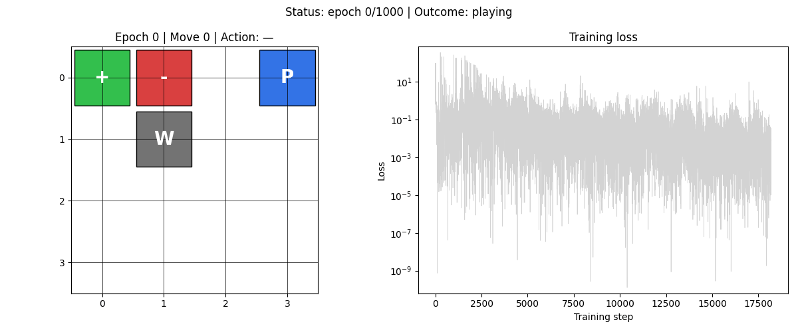
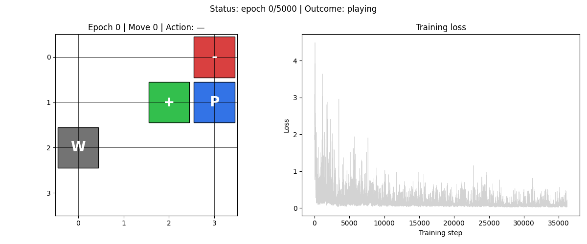

<!-- markdownlint-disable MD024 MD060 -->
# HW3 — DQN 及其變體


這份作業在 4×4 Gridworld 上逐步實作 DQN 的四個演化階段。環境有三種難度：`static`（棋盤固定）、`player`（只有玩家起點隨機）、`random`（所有棋子位置每局重設）。每個階段都有明確的對照組，讓改動的效果可以被量化。

---

## 結果一覽

| 階段 | 實驗 | 環境 | 勝率 | Loss | 時間 |
|------|------|------|------|------|------|
| HW3-1 | Naive DQN | static | 100% | 0.00777 ± 0.00995 | 14.9s |
| HW3-1 | DQN + Replay | random | 87.6% | 0.0632 ± 0.0385 | 50.1s |
| HW3-2 | Double DQN | player | 100% | 0.000408 ± 0.000102 | 32.8s |
| HW3-2 | Dueling DQN | player | 100% | 0.00843 ± 0.00415 | 35.0s |
| HW3-2 | Combined | player | 100% | **0.000334 ± 0.000120** | 39.6s |
| HW3-3 | Lightning baseline | random | 86.4% | 0.154 ± 0.199 | 137.0s |
| HW3-3 | + grad clip | random | 83.2% | 0.0559 ± 0.0874 | 146.5s |
| HW3-3 | + cosine sched | random | 88.2% | 2.123 ± 0.199 ⚠️ | 128.1s |
| HW3-3 | + Huber loss | random | 86.2% | 0.0757 ± 0.111 | 131.4s |
| HW3-3 | + 全部技巧 | random | 87.6% | 0.896 ± 0.054 ⚠️ | 146.2s |
| HW3-4 | Rainbow DQN | random | **13.4%** | 1.151 ± 0.137 (KL) | 1101.7s |

⚠️ 含 CosineAnnealingLR 的 loss 偏高是 lr → 0 的副作用，非策略退化（見 HW3-3 分析）

---

## 安裝與執行

```bash
pip install -r requirements.txt
pip install -e .
```

訓練指令：

```bash
# HW3-1
python -m src.dqn_naive  --mode static --epochs 1000
python -m src.dqn_replay --mode random --epochs 5000

# HW3-2
python -m src.dqn_double         --mode player --epochs 3000
python -m src.dqn_dueling        --mode player --epochs 3000
python -m src.dqn_double_dueling --mode player --epochs 3000

# HW3-3（五種配置）
for variant in baseline clip sched huber full; do
    python -m src.dqn_lightning --variant $variant --mode random --epochs 5000
done

# HW3-4
python -m src.rainbow --mode random --epochs 5000
```

生成 GIF 動畫：

```bash
python -m src.animate --exp <實驗名稱>
# 可用名稱：naive_static replay_random double_player dueling_player combined_player
#           baseline_random clip_random sched_random huber_random full_random rainbow_random
```

---

## HW3-1：從最基礎的 DQN 開始

**問題**：用最直白的方式實作 DQN——每一步直接算 TD loss 然後更新，看看能走多遠。

### Naive DQN（static 模式）

沒有 replay buffer，沒有 target network。每個 transition `(s, a, r, s')` 算出來就立刻 backward：

```
Y = r + γ · max_a' Q(s', a'; θ)    ← target 和 online 共用同一個 θ
loss = MSE( Q(s, a; θ), Y )
```

ε 從 1.0 線性退火到 0.1，前期多探索、後期貪心。

結果：static 棋盤只有一種初始配置，有效狀態數十幾個，Naive DQN 就夠了——1000 epoch 後達到 100% 勝率，訓練僅需 15 秒。Loss 曲線鋸齒狀下降（std 大於 mean），是 target 跟著 θ 一起動的症狀，但在這麼小的問題上不會崩潰。

### DQN + Experience Replay（random 模式）

切換到 random 模式後，每局棋盤不同，Naive DQN 的連續樣本相關性問題被放大到無法收斂。解法：

- **Replay buffer**（容量 1000）：transition 先存起來，再隨機抽 minibatch，打破時序相關性
- **Target network**：每隔 500 步才把 online 參數複製過去，穩定訓練目標

效果：random 模式 5000 epoch 後勝率 87.6%，loss 穩定下降。

| loss 曲線對比 | |
|:---:|:---:|
|  |  |
| Naive DQN — static | DQN + Replay — random |

| 動畫 | |
|:---:|:---:|
|  |  |
| Naive DQN — static　100% | DQN + Replay — random　87.6% |

---

## HW3-2：Double 與 Dueling 架構

切換到 player 模式（13 種起點隨機），驗證兩個針對 DQN 已知問題的修正。

### Double DQN — 壓制 Q 值高估

標準 DQN 用同一個 target network 同時選動作跟估值，max 運算會讓 Q 系統性偏高。Double DQN 把兩件事分開：

```
a* = argmax  Q_online(s', a')    ← 用 online net 選動作
Y  = r + γ · Q_target(s', a*)   ← 用 target net 查 Q 值
```

兩個網路偏誤方向不同，合起來抵消高估。Target net 仍是每 500 步同步一次。

### Dueling DQN — 分離狀態值與動作優勢

網路架構從單輸出改成兩個頭：

```
Q(s, a) = V(s) + A(s, a) − mean_a' A(s, a')
```

V(s) 不管選哪個動作都會被更新到，讓「這個狀態好不好」的資訊可以更快學到。在走廊、空地等多數動作等價的狀態尤其有效。

### Combined = 兩者疊加

Double 修 target 的算法、Dueling 改網路結構，作用點正交，可以直接合用。

| 三種方法 loss 比較 | | |
|:---:|:---:|:---:|
|  |  |  |
| Double　0.000408 ± 0.000102 | Dueling　0.00843 ± 0.00415 | Combined　**0.000334 ± 0.000120** |

三個方法勝率都是 100%，看不出差異，差異在 loss：Dueling 因為沒有 target network（這版實作），V/A 雙頭每次更新牽連更多參數，loss std 比 Double 高 40 倍。Combined 把 target net 加回來後把 loss 壓到最低。

| 動畫 | | |
|:---:|:---:|:---:|
|  |  |  |
| Double　100% | Dueling　100% | Combined　100% |

---

## HW3-3：PyTorch Lightning + 三種訓練技巧

把 Combined DQN 移植到 PyTorch Lightning，回到 random 模式，分別測試三種訓練改良的效果。

移植本身用 `LightningModule` + `IterableDataset`：每個 epoch 玩一局 Gridworld 填 replay buffer，DataLoader 做 minibatch 取樣。Trainer 接管訓練迴圈，callback 負責存 snapshot。

三個技巧：

| 技巧 | 設定 | 目的 |
|------|------|------|
| Gradient Clipping | max_norm = 10.0 | 防梯度爆炸 |
| CosineAnnealingLR | T_max = 5000 epochs | 後期精細收斂 |
| Huber Loss | SmoothL1Loss (δ=1.0) | 降低異常 TD error 的影響 |

**結果出乎意料**：沒有任何技巧明顯改善勝率，baseline 的 86.4% 幾乎是天花板。

| baseline | grad clip | cosine sched | Huber | 全套 |
|:---:|:---:|:---:|:---:|:---:|
|  |  |  |  |  |
| 86.4% / 0.154 | 83.2% / 0.056 | 88.2% / **2.123** ⚠️ | 86.2% / 0.076 | 87.6% / **0.896** ⚠️ |

`sched` 和 `full` 的 loss 高是因為 CosineAnnealingLR 在 5000 epoch 結束時把 lr 推到接近 0，此時模型幾乎停止更新，TD error 累積在 loss 上。勝率（88.2%）沒有受影響，loss 高是 lr 退到零後「學不動」的現象，不是策略退化。

`grad_clip=10.0` 對於這個只有 30K 參數的 MLP 來說閾值太寬鬆，正常梯度就接近這個數，裁剪幾乎沒有效果，但有時會剪掉有益的大梯度，把勝率從 86.4% 壓低到 83.2%。

| 動畫 | | | | |
|:---:|:---:|:---:|:---:|:---:|
|  |  |  |  |  |
| baseline | grad clip | cosine sched | Huber | 全套 |

---

## HW3-4：Rainbow DQN（加分題）

在 HW3-3 Combined 的基礎上疊加四個元件，實現完整 Rainbow：

```
HW3-3 Combined (Double + Dueling)
+ Prioritized Experience Replay  ← SumTree，依 TD error 優先取樣
+ N-step Returns (n=3)           ← 3 步折扣累積回報再 bootstrap
+ C51 Distributional RL          ← 51 個 atom 學回報分佈，而非純量 Q
+ NoisyNet                       ← 可學習的網路噪音取代 ε-greedy
```

| rainbow loss | rainbow 動畫 |
|:---:|:---:|
|  |  |

**結果：13.4% 勝率，比隨機行走（~25%）還差。**

KL loss 從 4 收斂到 1.15，訓練過程表面上「正常」，但策略是錯的。問題出在每個組件都假設了大規模環境：

C51 把 [−10, 10] 切成 51 個 atom，但 Gridworld 的 reward 只有 −1 / −10 / +1 三種，有效 atom 只有 3 個，Bellman 投影每步都要做對齊，在 48 個空 atom 上來回散布梯度，訓練信號稀疏且嘈雜。PER 在訓練初期把 Pit transition（TD error 最大）的取樣機率推到 70% 以上，模型反覆學「Pit 很糟」，卻因 buffer 太小而學不到足夠的「Goal 怎麼走」。NoisyNet 的 σ 在梯度的壓力下幾步就衰減到接近零，等同於早早關掉探索，buffer 填滿的都是重複路徑。N-step 在稀疏 reward 下把 3 步的 −1 都放大傳回，讓 Q 的估計更難準確。

這六個元件在 Atari（高維視覺狀態空間、密集或複雜的 reward 結構）下互補，搬到 64 格棋盤後每個假設都不成立，六個壞效果疊加。

---

## 專案結構

```
src/
├── gridboard.py            Gridworld 棋盤邏輯
├── gridworld_env.py        RL 環境封裝（static / player / random）
├── model.py                標準 MLP + Dueling MLP
├── utils.py                encode_state、ε-greedy、evaluate、set_seed
├── dqn_naive.py            Naive DQN（HW3-1）
├── dqn_replay.py           DQN + Replay（HW3-1）
├── dqn_double.py           Double DQN（HW3-2）
├── dqn_dueling.py          Dueling DQN（HW3-2）
├── dqn_double_dueling.py   Combined DQN（HW3-2）
├── dqn_lightning.py        Lightning + 三種技巧（HW3-3）
├── rainbow.py              完整 Rainbow DQN（HW3-4）
└── animate.py              Dashboard GIF 生成

results/
├── HW3-1/  naive_static / replay_random
├── HW3-2/  double_player / dueling_player / combined_player
├── HW3-3/  baseline_random / clip_random / sched_random / huber_random / full_random
└── HW3-4/  rainbow_random

HW3-1.md  HW3-2.md  HW3-3.md  HW3-4.md   各階段詳細分析報告
```

---

## 參考文獻

- Mnih et al. (2015). *Human-level control through deep reinforcement learning.* Nature.
- Hasselt et al. (2016). *Deep Reinforcement Learning with Double Q-learning.* AAAI.
- Wang et al. (2016). *Dueling Network Architectures for Deep Reinforcement Learning.* ICML.
- Hessel et al. (2017). *Rainbow: Combining Improvements in Deep Reinforcement Learning.* AAAI.
- Fortunato et al. (2018). *Noisy Networks for Exploration.* ICLR.
